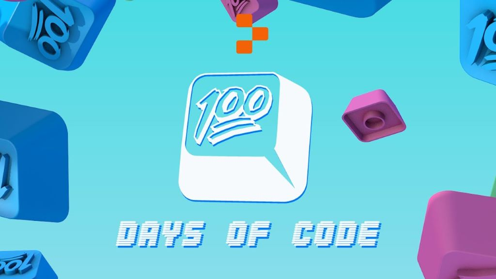

 
  
  

- [x] Day 1 - [Print Into The World](Day%201%20-%20Print%20Into%20The%20World/project_1.py)
- [x] Day 2 - [Getting To Know You](Day%202%20-%20Getting%20To%20Know%20You/project_2.py)
- [x] Day 3 - [The Ultimate Wacky Recipe Maker](Day%203%20-%20The%20Ultimate%20Wacky%20Recipe%20Maker/project_3.py)
- [x] Day 4 - [Everyone Loves A Good Story!](Day%204%20-%20Everyone%20Loves%20A%20Good%20Story!/project_4.py)
- [x] Day 5 - [Which Character Are You](Day%205%20-%20Which%20Character%20Are%20You/project_5.py)
- [x] Day 6 - [Login Program](Day%206%20-%20Login%20Program/project_6.py)
- [x] Day 7 - [Fake Fan Questions](Day%207%20-%20Fake%20Fan%20Questions/project_7.py)
- [x] Day 8 - [Affirmations](Day%208%20-%20Affirmations/project_8.py)
- [x] Day 9 - [Generation Generator](Day%209%20-%20Generation%20Generator/project_9.py)
- [x] Day 10 - [Extend Your Bill Calculator](Day%2010%20-%20Extend%20Your%20Bill%20Calculator/project_10.py)
- [x] Day 11 - [How Many Seconds Are In A Year](Day%2011%20-%20How%20Many%20Seconds%20Are%20In%20A%20Year/project_11.py)
- [x] Day 12 - [Debug My Code](Day%2012%20-%20Debug%20My%20Code/project_12.py)
- [x] Day 13 - [Exam Grade Calculator](Day%2013%20-%20Exam%20Grade%20Calculator/project_13.py)
- [x] Day 14 - [Rock - Paper - Scissors Game](Day%2014%20-%20Rock%20-%20Paper%20-%20Scissors%20Game/project_14.py)
- [x] Day 15 - [Animal Sound](Day%2015%20-%20Animal%20Sound/project_15.py)
- [x] Day 16 - [Name The Lyrics](Day%2016%20-%20Name%20The%20Lyrics/project_16.py)
- [x] Day 17 - [Scoring Rock-Paper-Scissors Game](Day%2017%20-%20Scoring%20Rock-Paper-Scissors%20Game/project_17.py)
- [x] Day 18 - [Guess The Number Game](Day%2018%20-%20Guess%20The%20Number%20Game/project_18.py)
- [x] Day 19 - [Loan Calculator](Day%2019%20-%20Loan%20Calculator/project_19.py)
- [x] Day 20 - [Number List Generator](Day%2020%20-%20Number%20List%20Generator/project_20.py)
- [x] Day 21 - [Math Game](Day%2021%20-%20Math%20Game/project_21.py)
- [x] Day 22 - [Guess The Random Number Game](Day%2022%20-%20Guess%20The%20Random%20Number%20Game/project_22.py)
- [x] Day 23 - [Login System](Day%2023%20-%20Login%20System/project_23.py)
- [x] Day 24 - [Infinity Dice](Day%2024%20-%20Infinity%20Dice/project_24.py)
- [x] Day 25 - [Character Stats Generator](Day%2025%20-%20Character%20Stats%20Generator/project_25.py)
- [x] Day 26 - [Play A Song](Day%2026%20-%20Play%20A%20Song/project_26.py)
- [x] Day 27 - [Video Game Creation](Day%2027%20-%20Video%20Game%20Creation/project_27.py)
- [x] Day 28 - [Game Battle System](Day%2028%20-%20Game%20Battle%20System/project_28.py)
- [x] Day 29 - [Text In Color](Day%2029%20-%20Text%20in%20color/project_29.py)
- [x] Day 30 - [30 Days Down](Day%2030%20-%2030%20Days%20Down/project_30.py)
- [x] Day 31 - [User Interface](Day%2031%20-%20User%20Interface/project_31.py)
- [x] Day 32 - [Greetings](Day%2032%20-%20Greetings/project_32.py)
- [x] Day 33 - [To Do List Manager](Day%2033%20-%20To%20Do%20List%20Manager/project_33.py)
- [x] Day 34 - [Get Spamming](Day%2034%20-%20Get%20Spamming/project_34.py)
- [x] Day 35 - [A Really Cool To Do List Manager](Day%2035%20-%20A%20Really%20Cool%20To%20Do%20List%20Manager/project_35.py)
- [x] Day 36 - [List Of People's Name](Day%2036%20-%20List%20Of%20People's%20Name/project_36.py)
- [x] Day 37 - [Star Wars Name Generator](Day%2037%20-%20Star%20Wars%20Name%20Generator/project_37.py)
- [x] Day 38 - [The Rainbow](Day%2038%20-%20The%20Rainbow/project_38.py)
- [x] Day 39 - [Veggy-Hangman](Day%2039%20-%20Veggy-Hangman/project_39.py)
- [x] Day 40 - [Contact Card](Day%2040%20-%20Contact%20Card/project_40.py)
- [x] Day 41 - [Website Dictionary](Day%2041%20-%20Website%20Dictionary/project_41.py)
- [x] Day 42 - [MokeBeast](Day%2042%20-%20MokeBeast/project_42.py)
- [x] Day 43 - [Bingo Card](Day%2043%20-%20Bingo%20Card/project_43.py)
- [x] Day 44 - [More Bingo](Day%2044%20-%20More%20Bingo/project_44.py)
- [x] Day 45 - [List Management System](Day%2045%20-%20List%20Management%20System/project_45.py)
- [x] Day 46 - [Mokebeast Mokedex](Day%2046%20-%20%20Mokebeast%20Mokedex/project_46.py)
- [x] Day 47 - [Top Trumps](Day%2047%20-%20Top%20Trumps/project_47.py)
- [x] Day 48 - [High Score Table](Day%2048%20-%20High%20Score%20Table/project_48.py)
- [x] Day 49 - [Current Leader](Day%2049%20-%20Current%20Leader/project_49.py)
- [x] Day 50 - [Idea storage system](Day%2050%20-%20Idea%20storage%20system/project_50.py)
- [x] Day 51 - [New To Do List](Day%2051%20-%20New%20To%20Do%20List/project_51.py)
- [x] Day 52 - [Pizza Place](Day%2052%20-%20Pizza%20Place/project_52.py)
- [x] Day 53 - [RPG inventory](Day%2053%20-%20RPG%20inventory/project_53.py)
- [x] Day 54 - [Shop Tracker](Day%2054%20-%20Shop%20Tracker/project_54.py)
- [x] Day 55 - [Backup Folder](Day%2055%20-%20Backup%20Folder/project_55.py)
- [x] Day 56 - [Music Streaming Service](Day%2056%20-%20Music%20Streaming%20Service/project_56.py)
- [x] Day 57 - [Factorial Finder](Day%2057%20-%20Factorial%20Finder/project_57.py)
- [x] Day 58 - [Debugging](Day%2058%20-%20Debugging/project_58.py)
- [x] Day 59 - [Palindrome Checker](Day%2059%20-%20Palindrome%20Checker/project_59.py)
- [x] Day 60 - [Event Countdown Timer](Day%2060%20-%20Event%20Countdown%20Timer/project_60.py)
- [x] Day 61 - [Let's tweet](Day%2061%20-%20Let's%20tweet/project_61.py)
- [x] Day 62 - [Private Diary](Day%2062%20-%20Private%20Diary/project_62.py)
- [x] Day 63 - [Multiple Files](Day%2063%20-%20Multiple%20Files/project_63.py)
- [x] Day 64 - [Jobs Classes](Day%2064%20-%20Jobs%20Classes/project_64.py)
- [x] Day 65 - [Characters For Video Game](Day%2065%20-%20Characters%20For%20Video%20Game/project_65.py)
- [x] Day 66 - [GUI calculator](Day%2066%20-%20GUI%20calculator/project_66.py)
- [x] Day 67 - [Guess Who](Day%2067%20-%20Guess%20Who/project_67.py)
- [x] Day 68 - [Guess Who Hiding Images](Day%2068%20-%20Guess%20Who%20Hiding%20Images/project_68.py)
- [x] Day 70 - [Login System](Day%2070%20-%20Login%20System/project_70.py)
- [x] Day 71 - [Login System - Hashing](Day%2071%20-%20Login%20System%20-%20Hashing/project_71.py)
- [x] Day 72 - [Secure Private Diary](Day%2072%20-%20Secure%20Private%20Diary/project_72.py)
- [x] Day 73 - [Web portfolio - Start](Day%2073%20-%20Web%20portfolio%20-%20Start/index.html)
- [x] Day 74 - [Style Web Portfolio](Day%2074%20-%20Style%20Web%20Portfolio/index.html)
- [x] Day 75 - [Link Tree Website](Day%2075%20-%20Link%20Tree%20Website/index.html)
- [x] Day 76 - [Flask Web Server](Day%2076%20-%20Flask%20Web%20Server/project_76.py)
- [x] Day 77 - [Flask Template For A Blog](Day%2077%20-%20Flask%20Template%20For%20A%20Blog/project_77.py)
- [x] Day 78 - [Flask Store Reflections](Day%2078%20-%20Flask%20Store%20Reflections/project_78.py)
- [x] Day 79 - [Login Form For Webpage](Day%2079%20-%20%20Login%20Form%20For%20Webpage/index.html)
- [x] Day 80 - [Flask Login Form](Day%2080%20-%20%20Flask%20Login%20Form/project_80.py)
- [x] Day 81 - [I'm Not A Robot](Day%2081%20-%20I'm%20not%20a%20robot/project_81.py)
- [x] Day 82 - [Bilingual Website](Day%2082%20-%20Bilingual%20Website/project_82.py)
- [x] Day 83 - [Custom Themes to The Blog](Day%2083%20-%20%20Custom%20Themes%20to%20The%20Blog/project_83.py)
- [x] Day 84 - [Flask Signup Form](Day%2084%20-%20Flask%20Signup%20Form/project_84.py)
- [x] Day 85 - [Flask Login System](Day%2085%20-%20Flask%20Login%20System/project_85.py)
